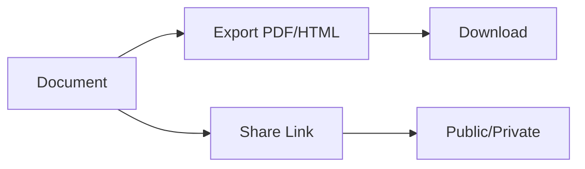

## Overview

孙 浩 provides powerful tools to streamline your documentation workflow. You organize content into folders, edit with rich formatting, track changes via version control, search efficiently, and share or export documents seamlessly.

<Columns cols={3}>
  <Card title="Document Organization" icon="folder" href="#organization">
    Structure your docs hierarchically with folders and subfolders.
  </Card>
  <Card title="Editing Tools" icon="edit-3" href="#editing">
    Rich text editing with Markdown support and live previews.
  </Card>
  <Card title="Version Control" icon="git-branch" href="#version-control">
    Track changes, revert edits, and collaborate without conflicts.
  </Card>
  <Card title="Search & Filtering" icon="search" href="#search">
    Find content quickly across your documentation space.
  </Card>
  <Card title="Export & Sharing" icon="share-2" href="#export">
    Generate PDFs, share links, or embed docs externally.
  </Card>
</Columns>

## Document Organization and Folders

Organize your documentation into intuitive folder structures. Create nested folders to group related pages, making navigation effortless for teams.

<Steps>
  <Step title="Create a Folder" icon="folder-plus">
    In the sidebar, click the new folder button and name it, such as `API Reference`.
  </Step>
  <Step title="Add Documents" icon="file-plus">
    Drag pages into folders or create new docs directly inside them.
  </Step>
  <Step title="Nest Folders" icon="folder">
    Right-click a folder to create subfolders for deeper categorization, like `API Reference/v1/endpoints`.
  </Step>
</Steps>

```bash
# Example folder structure
docs/
├── introduction.mdx
├── api/
│   ├── authentication.mdx
│   └── endpoints.mdx
└── guides/
    └── quickstart.mdx
```

<Callout kind="tip">
  Use descriptive folder names to improve discoverability. Limit nesting to three levels for optimal navigation.
</Callout>

## Editing and Formatting Tools

Edit documents with a WYSIWYG editor supporting Markdown, code blocks, and embeds. Preview changes in real-time.

<Tabs>
  <Tab title="Markdown Mode" icon="code">
    Write structured content using standard Markdown syntax.

````markdown
# Heading

**Bold text** and _italic_ emphasis.

- List item
- Another item

```javascript
console.log("Hello, 孙 浩!");
```
````
  </Tab>
  <Tab title="Visual Editor" icon="edit">
    Click buttons for headings, lists, and tables without typing Markdown.
  </Tab>
</Tabs>

## Version Control for Docs

孙 浩 tracks every change automatically. View history, compare versions, and restore previous states.

<Expandable title="View Version History" default-open="true">
  Select a document, click `History`, and browse commits. Revert by selecting a version.

  Each change logs the author, timestamp, and diff highlights.
</Expandable>

## Search and Filtering Functions

Search across all documents with full-text indexing. Filter by folder, tags, or date.

| Filter Type | Description | Example |
|-------------|-------------|---------|
| Full Text | Matches keywords in title or body | `authentication` |
| Folder | Limits to specific paths | `api/` |
| Tags | Filters by user-assigned labels | `#internal` |
| Date Range | Recent changes only | `last 7 days` |

<Callout kind="info">
  Use quotes for exact phrases: `"user authentication"`.
</Callout>

## Export and Sharing Options

Export docs to PDF, HTML, or Markdown archives. Generate shareable public links with optional passwords.

<CodeGroup tabs="CLI,API">
  ```bash
  # Export via CLI
  sunhao export --folder=api --format=pdf output.pdf
  ```

  ```javascript
  // Export via API
  fetch('https://api.example.com/export', {
    method: 'POST',
    headers: { 'Authorization': 'Bearer YOUR_TOKEN' },
    body: JSON.stringify({ folder: 'api', format: 'pdf' })
  });
  ```
</CodeGroup>



<Callout kind="success">
  Exported files retain formatting and links for seamless offline use.
</Callout>